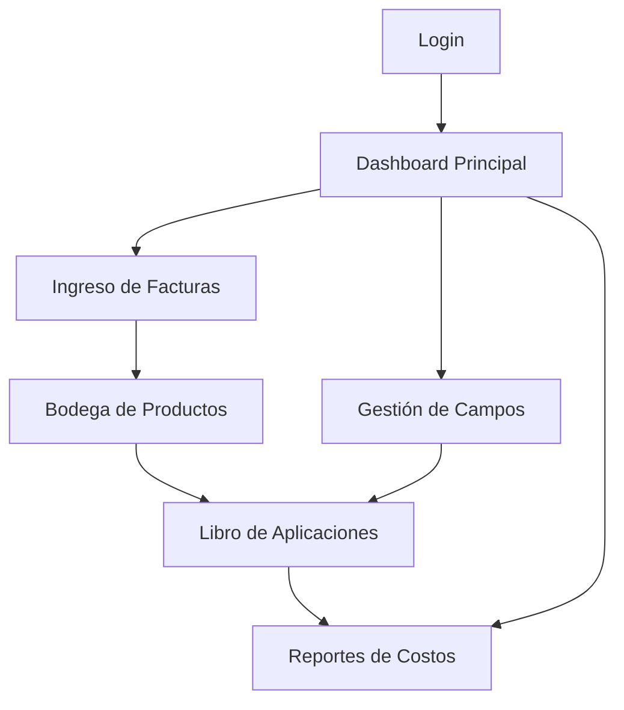

## 1. Product Overview
Aplicación web para gestión de costos agrícolas por hectárea, permitiendo el control de múltiples empresas, campos, inventario de productos químicos y cálculo automático de costos ponderados.

Diseñada para productores agrícolas que necesitan controlar y analizar los costos de producción por hectárea en tiempo real, optimizando la toma de decisiones financieras.

## 2. Core Features

### 2.1 User Roles
| Role | Registration Method | Core Permissions |
|------|---------------------|------------------|
| Administrador | Email registration | Acceso completo a todas las empresas, configuración de sistema |
| Gerente Agrícola | Invitación por administrador | Gestión de campos, facturas, bodega y aplicaciones |
| Supervisor de Campo | Invitación por administrador | Registro de aplicaciones, consulta de inventario |

### 2.2 Feature Module
Nuestra aplicación de centro de costo agrícola consta de las siguientes páginas principales:

1. **Dashboard Principal**: selector de empresa, resumen de costos por campo, acceso rápido a módulos.
2. **Gestión de Campos**: lista de campos, detalles por hectárea, tipos de frutales, sectores.
3. **Ingreso de Facturas**: formulario de facturas, clasificación de items, proveedores, montos.
4. **Bodega de Productos**: inventario de productos químicos, entradas por factura, stock actual.
5. **Libro de Aplicaciones**: registro de aplicaciones por campo, consumo de productos, costo calculado.
6. **Reportes de Costos**: costo por hectárea, historial de aplicaciones, análisis por campo/empresa.

### 2.3 Page Details
| Page Name | Module Name | Feature description |
|-----------|-------------|---------------------|
| Dashboard Principal | Selector de Empresa | Cambiar entre diferentes empresas agrícolas, ver resumen general. |
| Dashboard Principal | Resumen de Costos | Mostrar costo total y por hectárea de cada campo activo. |
| Dashboard Principal | Accesos Rápidos | Navegación directa a ingreso de facturas, bodega y aplicaciones. |
| Gestión de Campos | Lista de Campos | Ver todos los campos de la empresa seleccionada con hectáreas totales. |
| Gestión de Campos | Detalle de Campo | Información del campo, sectores, tipo de frutal, hectáreas por sector. |
| Gestión de Campos | Mapa de Sectores | Visualización gráfica de la distribución de hectáreas. |
| Ingreso de Facturas | Formulario de Factura | Ingresar número, fecha, proveedor, monto total, observaciones. |
| Ingreso de Facturas | Items de Factura | Agregar productos con cantidad, precio unitario, clasificación (fertilizante, pesticida, herbicida). |
| Ingreso de Facturas | Validación de Datos | Verificar duplicados, calcular total automáticamente, guardar en bodega. |
| Bodega de Productos | Inventario Actual | Mostrar stock por producto, unidad de medida, precio promedio ponderado. |
| Bodega de Productos | Historial de Movimientos | Ver entradas por factura y salidas por aplicaciones con fechas. |
| Bodega de Productos | Alertas de Stock | Notificar cuando productos estén por debajo del mínimo. |
| Libro de Aplicaciones | Nueva Aplicación | Seleccionar campo, sector, fecha, productos a aplicar, cantidades. |
| Libro de Aplicaciones | Cálculo de Costo | Automáticamente calcular costo usando precio promedio ponderado del producto. |
| Libro de Aplicaciones | Registro de Aplicación | Descontar productos de bodega, generar registro con costo total. |
| Reportes de Costos | Costo por Hectárea | Mostrar costo acumulado por campo y sector en período seleccionado. |
| Reportes de Costos | Detalle de Aplicaciones | Listar todas las aplicaciones con productos usados y costos. |
| Reportes de Costos | Exportar Reportes | Generar archivos Excel/PDF con los datos de costos. |

## 3. Core Process
### Flujo Principal de Usuario
1. El usuario inicia sesión y selecciona la empresa agrícola a gestionar.
2. Accede al dashboard para ver el resumen de costos por campo.
3. Ingresa nuevas facturas de proveedores con productos químicos, estos automáticamente incrementan el inventario en bodega.
4. Cuando se realiza una aplicación en el campo, registra en el libro de aplicaciones los productos utilizados.
5. El sistema calcula el costo usando el método de precio promedio ponderado y descuenta del inventario.
6. Puede generar reportes de costo por hectárea para análisis y toma de decisiones.

## 4. User Interface Design
### 4.1 Design Style
- **Colores Primarios**: Verde #2E7D32 (agricultura), Azul #1976D2 (confianza)
- **Colores Secundarios**: Gris #757575, Blanco #FFFFFF, Amarillo #FFC107 (alertas)
- **Estilo de Botones**: Rounded corners, sombra sutil, hover effects
- **Tipografía**: Inter para headers, Roboto para body text
- **Tamaños de Fuente**: Headers 24-32px, Body 14-16px, Small 12px
- **Layout**: Card-based design con navegación lateral
- **Iconos**: Estilo outline de Material Design Icons

### 4.2 Page Design Overview
| Page Name | Module Name | UI Elements |
|-----------|-------------|-------------|
| Dashboard Principal | Selector de Empresa | Dropdown con logo de empresa, color verde principal. |
| Dashboard Principal | Resumen de Costos | Cards con métricas, gráficos de barras para costos por campo. |
| Ingreso de Facturas | Formulario | Inputs con labels flotantes, validación en tiempo real, botón guardar verde. |
| Bodega de Productos | Tabla de Inventario | Tabla responsive con sorting, filtros por tipo de producto. |
| Libro de Aplicaciones | Formulario de Aplicación | Date picker, dropdowns con búsqueda, calculadora de costos automática. |

### 4.3 Responsiveness
- Desktop-first design con breakpoints en 1200px, 768px, 480px
- Adaptación automática para tablets y móviles
- Menú hamburger en dispositivos móviles
- Tablas con scroll horizontal en pantallas pequeñas
- Touch-friendly con botones mínimo 44px