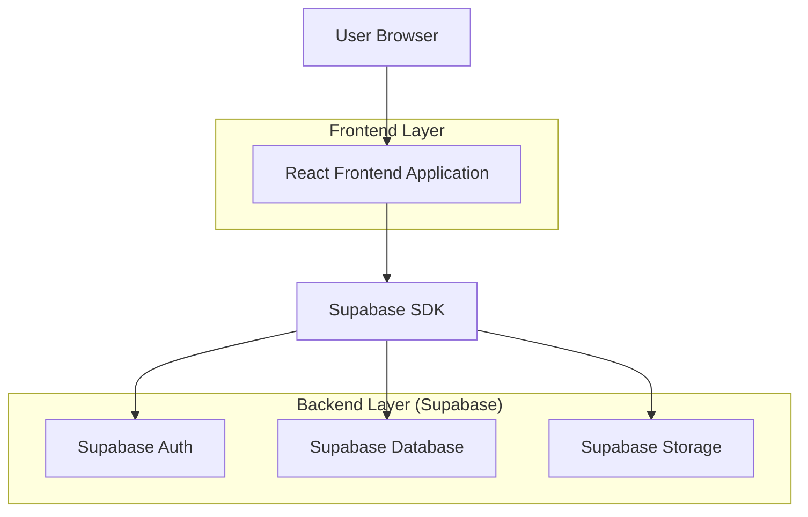
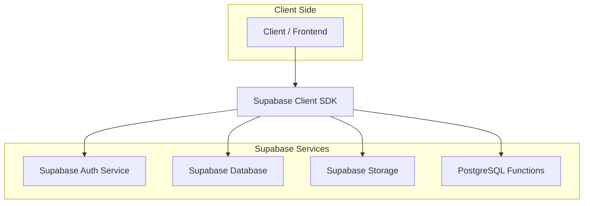
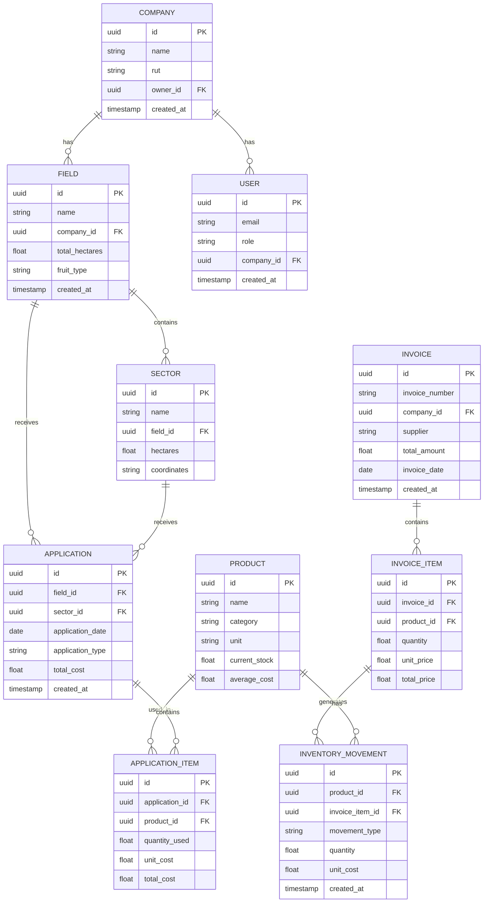

## 1. Architecture design



## 2. Technology Description
- Frontend: React@18 + tailwindcss@3 + vite
- Initialization Tool: vite-init
- Backend: Supabase (BaaS)
- Database: PostgreSQL (via Supabase)
- Authentication: Supabase Auth
- Storage: Supabase Storage (para archivos de facturas)

## 3. Route definitions
| Route | Purpose |
|-------|---------|
| / | Dashboard Principal, resumen de costos y accesos rápidos |
| /login | Login page, autenticación de usuarios |
| /campos | Gestión de campos y sectores |
| /facturas | Ingreso y listado de facturas |
| /bodega | Inventario de productos y movimientos |
| /aplicaciones | Libro de aplicaciones de productos |
| /reportes | Reportes de costos por hectárea |
| /configuracion | Configuración de empresa y usuarios |

## 4. API definitions
### 4.1 Authentication API

```
POST /auth/v1/token
```

Request:
| Param Name| Param Type  | isRequired  | Description |
|-----------|-------------|-------------|-------------|
| email     | string      | true        | Email del usuario |
| password  | string      | true        | Contraseña del usuario |

Response:
| Param Name| Param Type  | Description |
|-----------|-------------|-------------|
| access_token | string   | Token JWT para autenticación |
| user      | object      | Datos del usuario autenticado |

### 4.2 Database Operations (via Supabase SDK)

**Companies Table Operations**
```javascript
// Listar empresas del usuario
const { data, error } = await supabase
  .from('companies')
  .select('*')
  .eq('user_id', user.id);
```

**Fields Table Operations**
```javascript
// Obtener campos por empresa
const { data, error } = await supabase
  .from('fields')
  .select('*, sectors(*)')
  .eq('company_id', companyId);
```

**Invoices Table Operations**
```javascript
// Insertar factura con items
const { data, error } = await supabase
  .from('invoices')
  .insert([{
    company_id: companyId,
    invoice_number: 'FAC-001',
    supplier: 'Proveedor S.A.',
    total_amount: 1500.00,
    invoice_date: '2024-01-15'
  }]);
```

**Inventory Operations with Cost Calculation**
```javascript
// Actualizar inventario y calcular promedio ponderado
const { data, error } = await supabase
  .rpc('update_inventory_with_average_cost', {
    product_id: productId,
    quantity_in: quantity,
    unit_cost: cost,
    invoice_id: invoiceId
  });
```

## 5. Server architecture diagram


## 6. Data model

### 6.1 Data model definition


### 6.2 Data Definition Language

**Companies Table**
```sql
CREATE TABLE companies (
  id UUID PRIMARY KEY DEFAULT gen_random_uuid(),
  name VARCHAR(255) NOT NULL,
  rut VARCHAR(20) UNIQUE,
  owner_id UUID REFERENCES auth.users(id),
  created_at TIMESTAMP WITH TIME ZONE DEFAULT NOW(),
  updated_at TIMESTAMP WITH TIME ZONE DEFAULT NOW()
);

GRANT SELECT ON companies TO anon;
GRANT ALL ON companies TO authenticated;
```

**Fields Table**
```sql
CREATE TABLE fields (
  id UUID PRIMARY KEY DEFAULT gen_random_uuid(),
  name VARCHAR(255) NOT NULL,
  company_id UUID REFERENCES companies(id),
  total_hectares DECIMAL(10,2) NOT NULL,
  fruit_type VARCHAR(100),
  created_at TIMESTAMP WITH TIME ZONE DEFAULT NOW(),
  updated_at TIMESTAMP WITH TIME ZONE DEFAULT NOW()
);

GRANT SELECT ON fields TO anon;
GRANT ALL ON fields TO authenticated;
```

**Products Table**
```sql
CREATE TABLE products (
  id UUID PRIMARY KEY DEFAULT gen_random_uuid(),
  name VARCHAR(255) NOT NULL,
  category VARCHAR(50) CHECK (category IN ('fertilizante', 'pesticida', 'herbicida', 'fungicida', 'otro')),
  unit VARCHAR(20) NOT NULL,
  current_stock DECIMAL(10,2) DEFAULT 0,
  average_cost DECIMAL(10,2) DEFAULT 0,
  company_id UUID REFERENCES companies(id),
  created_at TIMESTAMP WITH TIME ZONE DEFAULT NOW(),
  updated_at TIMESTAMP WITH TIME ZONE DEFAULT NOW()
);

GRANT SELECT ON products TO anon;
GRANT ALL ON products TO authenticated;
```

**Invoices Table**
```sql
CREATE TABLE invoices (
  id UUID PRIMARY KEY DEFAULT gen_random_uuid(),
  invoice_number VARCHAR(100) NOT NULL,
  company_id UUID REFERENCES companies(id),
  supplier VARCHAR(255) NOT NULL,
  total_amount DECIMAL(10,2) NOT NULL,
  invoice_date DATE NOT NULL,
  created_at TIMESTAMP WITH TIME ZONE DEFAULT NOW(),
  updated_at TIMESTAMP WITH TIME ZONE DEFAULT NOW()
);

GRANT SELECT ON invoices TO anon;
GRANT ALL ON invoices TO authenticated;
```

**PostgreSQL Function for Average Cost Calculation**
```sql
CREATE OR REPLACE FUNCTION update_inventory_with_average_cost(
  product_id UUID,
  quantity_in DECIMAL,
  unit_cost DECIMAL,
  invoice_item_id UUID
)
RETURNS VOID AS $$
DECLARE
  current_avg_cost DECIMAL;
  current_stock DECIMAL;
  new_avg_cost DECIMAL;
  new_stock DECIMAL;
BEGIN
  -- Get current values
  SELECT average_cost, current_stock INTO current_avg_cost, current_stock
  FROM products WHERE id = product_id;
  
  -- Calculate new average cost (weighted average)
  new_stock := current_stock + quantity_in;
  IF new_stock > 0 THEN
    new_avg_cost := ((current_avg_cost * current_stock) + (unit_cost * quantity_in)) / new_stock;
  ELSE
    new_avg_cost := unit_cost;
  END IF;
  
  -- Update product
  UPDATE products SET
    current_stock = new_stock,
    average_cost = new_avg_cost,
    updated_at = NOW()
  WHERE id = product_id;
  
  -- Record inventory movement
  INSERT INTO inventory_movements (product_id, invoice_item_id, movement_type, quantity, unit_cost)
  VALUES (product_id, invoice_item_id, 'entrada', quantity_in, unit_cost);
END;
$$ LANGUAGE plpgsql;
```